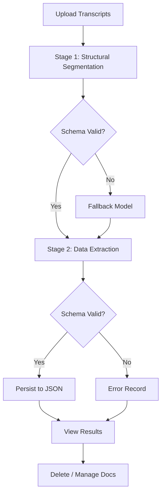

# REII – Spanish Discourse Analysis Pipeline

**ALCESTE‑style computational linguistics for Spanish qualitative data. Presented at IV International Congress of Human Sciences (Sep 2026) **

REII is a production‑grade NLP pipeline for Spanish discourse analysis, implementing a progressive segmentation algorithm inspired by the ALCESTE method. It combines traditional statistical approaches with transformer‑based models to classify text segments, extract semantic networks, and generate interpretable discourse structures. The pipeline can be theoretically adapted for different


## 🧠 Core NLP Capabilities

### Advanced Text Segmentation with Sliding Window

REII's most distinctive feature is its **progressive text segmentation** with a **sliding window** for coreference resolution. Unlike traditional fixed‑window or sentence‑based segmentation, this approach:

- **Preserves discourse continuity** – Segments overlap, ensuring that cross‑sentential references are not lost.
- **Resolves coreferences** – Using **Stanza** (Stanford NLP), the system identifies anaphoric references across the sliding window, maintaining referential coherence even when entities span multiple sentences.
- **Adapts to text length** – The window size is configurable based on document length and genre, optimising for both short interview excerpts and long transcripts.
- **Handles Spanish linguistic complexity** – The pipeline is specifically tuned for Spanish, with custom lexicons and grammar rules for the language's rich morphology and flexible syntax.

#### How the Sliding Window Works

```text
Document: [s1] [s2] [s3] [s4] [s5] [s6] [s7] [s8] [s9]

Window 1: [s1] [s2] [s3] [s4] [s5] → extract features
Window 2: [s2] [s3] [s4] [s5] [s6] → extract features
Window 3: [s3] [s4] [s5] [s6] [s7] → extract features
```

Each window is processed for:

- **Coreference chains** – Identifying which entities (people, organisations, concepts) are being referred to across the segment.
- **Lexical cohesion** – Measuring vocabulary overlap and semantic relatedness between adjacent windows.
- **Discourse markers** – Detecting transitional phrases that signal shifts in topic or argument.

This sliding‑window approach ensures that no discourse‑level meaning is lost, while still producing granular, analysable units for classification and network construction.

### Classification Pipeline

REII offers two parallel classification workflows:

| Pipeline                                 | Backend                                     | Use Case                           |
| ---------------------------------------- | ------------------------------------------- | ---------------------------------- |
| **Classic** (`main_workflow_clasico.py`) | Statistical NLP (spaCy, custom lexicons)    | Lightweight, fast, no GPU required |
| **Transformer** (`main_workflow.py`)     | Transformer models (fine‑tuned for Spanish) | Higher accuracy, requires GPU      |

Both pipelines produce:

- **UCE (Unités de Contexte Élémentaires)** – The atomic units of discourse, similar to elementary context units in ALCESTE.
- **Discourse classifications** – Each segment is assigned to a discourse type (e.g., narrative, argumentative, descriptive).
- **Semantic networks** – Co‑occurrence graphs of key terms, visualising conceptual structures.

### AI Discourse Agent

The `ia_discursiva.py` module provides an optional **Together AI‑powered** discourse agent that can:

- Generate natural‑language summaries of discourse patterns.
- Propose interpretive labels for emerging themes.
- Suggest relationships between discourse units.

This agent uses the DeepSeek‑V4.1‑Flash model via the Together AI API, with automatic fallback to a secondary model on schema‑validation failure. It is invoked only when the researcher chooses, preserving the inductive integrity of the pipeline.

### Batch Interview Processing

The batch processing component (`batch_processor.py` + `guia_entrevista.py`) provides an automated two‑stage pipeline for processing groups of Spanish interview transcripts. It is accessible via a dedicated tab in the Streamlit dashboard ("Procesamiento por lotes (entrevistas)").

#### Pipeline Overview



**Stage 1 — Structural Segmentation** — Divides each transcript into sequential blocks following a 32‑question interview guide (sociodemographics, climate change perceptions, education, mitigation actions, and future perspectives). Conserves literal text with minimal cleaning of transcription artifacts.

**Stage 2 — Data Extraction** — Maps responses from each segment to structured fields: 11 sociodemographic fields, climate conception fields (arrays included), education and mitigation arrays, and future‑outlook fields. Unanswered questions are marked `"NO ESTÁ PRESENTE"` or `[]`.

The per‑document results are persisted in `data/entrevistas.json` and managed through the dashboard's file upload → process → view → delete workflow.

## 🏗️ Architecture

```mermaid
flowchart TD
    %% Style Definitions
    classDef dash fill:#e1f5fe,stroke:#01579b,stroke-width:2px,color:#000;
    classDef pipeline fill:#f3e5f5,stroke:#4a148c,stroke-width:2px,color:#000;
    classDef lang fill:#fff3e0,stroke:#e65100,stroke-width:2px,color:#000;
    classDef optional fill:#e8f5e9,stroke:#1b5e20,stroke-width:2px,color:#000;

    subgraph Layer1_Dashboard ["Streamlit Dashboard"]
        D1[Interactive visualisation of results]
        D2[Batch interview processor]
    end

    subgraph Layer2_Pipeline ["Core Pipeline"]
        P1[Progressive Segmentation] --> P2[Grammar & UCE Analysis] --> P3[Semantic Network Construction]
    end

    subgraph Layer3_Resources ["Language Resources"]
        R1[Spanish Grammar Rules] --> R2[Custom Lexicons] --> R3[spaCy & Stanza Models]
    end

    subgraph Layer4_Optional ["Optional Modules"]
        O1[AI Discourse Agent (Together AI)]
        O2[Summary Generation]
        O3[Thematic Proposal]
        O4[Relationship Suggestion]
        O1 --- O2
        O1 --- O3
        O1 --- O4
        O5[Batch Interview Processor (guide + extraction)]
    end

    %% Vertical Connections between Layers
    D1 --> P1
    D2 --> O5
    P3 --> R1
    R3 --> O1
    R3 -.-> O5

    %% Dashed optional connection from Core Pipeline to Optional Modules
    P3 -.-> O1

    %% Apply Styles
    class D1 dash
```

## 📦 Quick Start

### Using Docker (Recommended)

```bash
# Clone the repository
git clone https://github.com/diegopaucarv/reii.git
cd reii

# Start the dashboard
docker-compose up dashboard

# Run the batch pipeline (classic, lightweight)
docker-compose run workflow
```

### Local Installation

```bash
# Install the package
pip install -e .

# Download Spanish spaCy model
python -m spacy download es_core_news_lg

# Run the dashboard
streamlit run src/reii/dashboard.py

# Run the classic pipeline
export REII_DATA_DIR=./data/input
python src/reii/main_workflow_clasico.py
```

#### Environment Variables

| Variable                  | Default                                       | Description                                                            |
| ------------------------- | --------------------------------------------- | ---------------------------------------------------------------------- |
| `REII_DATA_DIR`           | `./data/input`                                | Path to input documents                                                |
| `REII_ROOT_DIR`           | `.`                                           | Project root for output resolution                                     |
| `TOGETHER_API_KEY`        | _(empty)_                                     | API key for the Together AI discourse agent (required for AI features) |
| `TOGETHER_API_URL`        | `https://api.together.ai/v1/chat/completions` | Together AI API endpoint                                               |
| `REII_LLM_MODEL`          | `deepseek-ai/DeepSeek-V4.1-Flash`             | Primary LLM model (Together AI)                                        |
| `REII_LLM_FALLBACK_MODEL` | `Prism-ML/Ternary-Bonsai-27B`                 | Fallback model on schema‑failure                                       |
| `REII_LLM_MAX_RETRIES`    | `5`                                           | Retry count per model before fallback                                  |
| `REII_BATCH_DB_PATH`      | `data/entrevistas.json`                       | Batch processor persistent store                                       |
| `REII_TRANSCRIPTS_DIR`    | `data/entrevistas`                            | Directory for uploaded interview transcripts                           |

## 📁 Project Structure

```text
reii/
├── src/reii/
│   ├── gram/               # Grammar analysis, UCE extraction, NLP pipeline
│   ├── lang/               # Spanish language rules & custom lexicons
│   ├── seg/                # Progressive text segmentation (sliding window)
│   ├── dashboard.py        # Streamlit interactive dashboard
│   ├── main_workflow.py    # Transformer‑based pipeline (heavy)
│   ├── main_workflow_clasico.py  # Statistical pipeline (light)
│   ├── ia_discursiva.py    # AI discourse agent (Together AI API)
│   ├── batch_processor.py  # Batch interview processor class
│   └── guia_entrevista.py  # 32‑question interview guide data
├── data/                   # Input and output data
│   ├── entrevistas/        # Uploaded interview transcripts
│   └── entrevistas.json    # Batch processor persistent store
├── docker-compose.yml      # Container orchestration
└── setup.py                # Package installation
```

## 🔬 Methodology

REII is inspired by the ALCESTE (Analyse des Lexèmes Co‑occurrents dans un Ensemble de Segments de Texte) method, adapted for Spanish discourse analysis. Key principles:

- Progressive segmentation – Text is segmented iteratively, with each pass refining the boundaries based on lexical and syntactic cues.

- Contextual classification – Segments are classified not in isolation, but within their discourse context, using the sliding window to maintain coherence.

- Semantic network construction – Co‑occurrence graphs reveal the latent conceptual structure of the corpus, supporting both exploratory and confirmatory analysis.

The sliding‑window coreference resolution, powered by Stanza, is particularly valuable for Spanish, where anaphoric references are frequent and pronouns are often dropped (pro‑drop language) – making coreference chains harder to detect without broader context.
